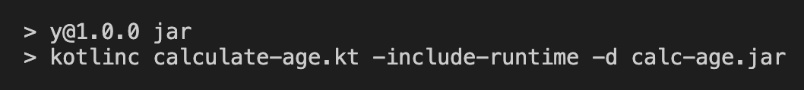
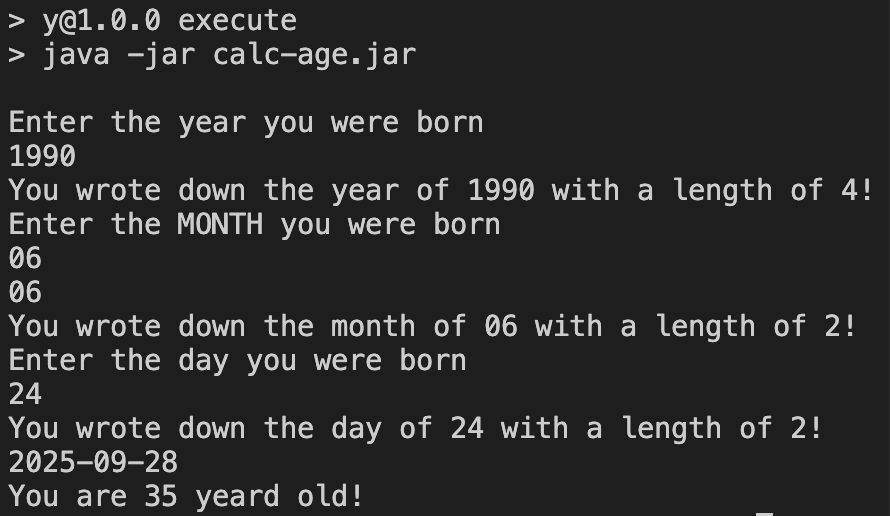

# Get your age by Date Of Birth (DOB)

## Description
Age in Minutes/Hours App: Users input their birthdate, and the app calculates their age in minutes or hours. This involves working with date and time objects, input handling, and displaying calculated results.

## Scripts
1. __Convert .kt file to .jar file__  
npm <em>[run|urn]</em> jar

2. __Execute .jar file with java runtime__  
npm <em>[run|urn]</em> execute

 

## Convert Kotlin to Java ARchive

## Program execution

